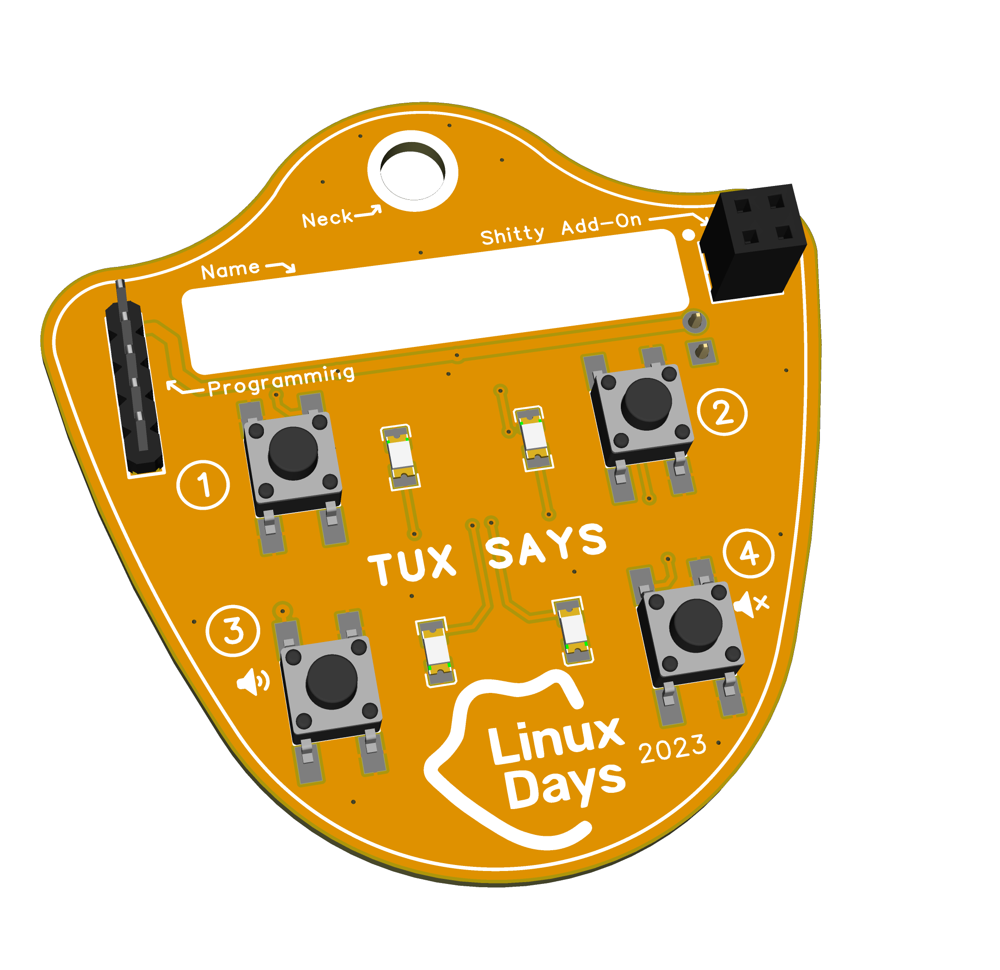

# 🐧 Tux Says

Project of development board in form of badge for LinuxDays conference. 
It is based on CH32V003 MCU and implements simple game called **Tux Says** inspirated by elecronic game [Simon](https://en.wikipedia.org/wiki/Simon_(game)).

*Tux Says is a simple game where you have to repeat the sequence of sounds and colors that Tux makes.*

## HW

- [Schematics](hw/tux_schematics.png)
